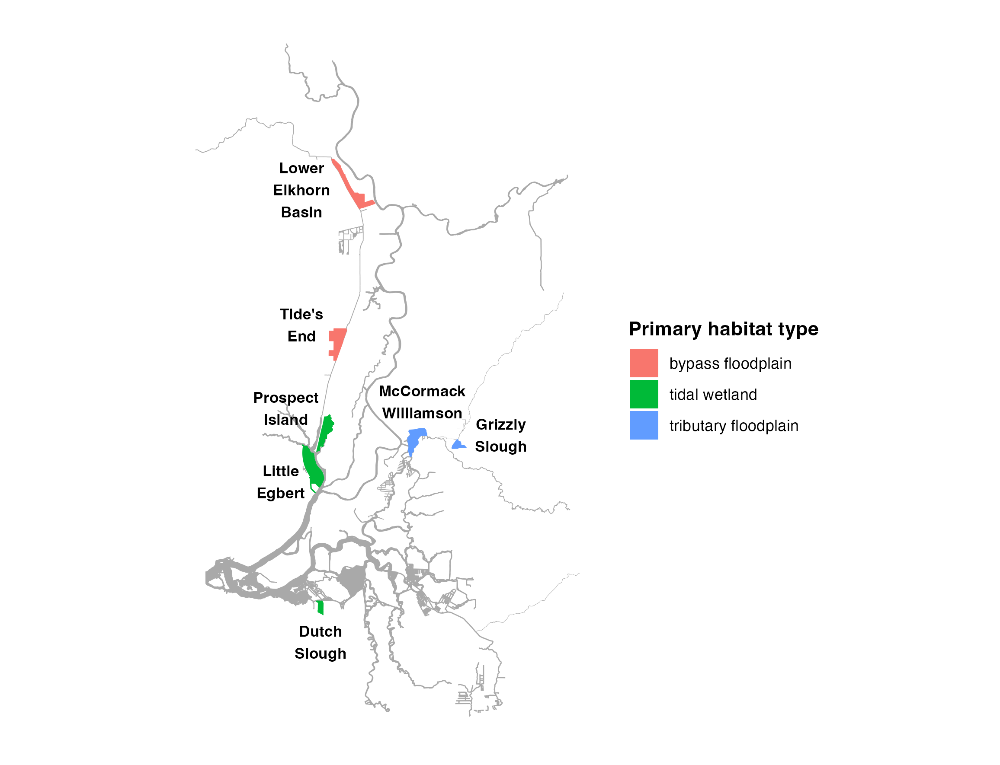

# Healthy Rivers and Landscapes Project Maps

This repository contains code to make maps of Healthy Rivers and Landscapes
non-flow measure project locations. Most non-flow measures are restoration
projects that create tidal wetland, bypass floodplain, tributary floodplain, and
tributary instream rearing habitat. Other non-flow measures include fish passage
improvement, fish food production, and predator management.

*Map of DWR early implementation HRL projects in the Delta and Yolo Bypass*

Please email Lucy Andrews at [lucy.andrews@water.ca.gov](mailto:lucy.andrews@water.ca.gov)
with any questions.